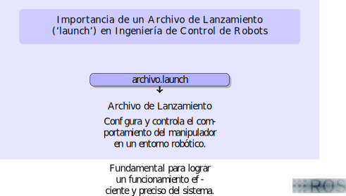
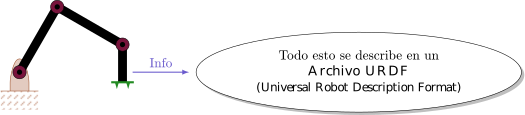
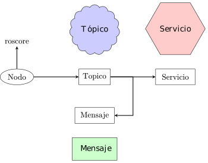
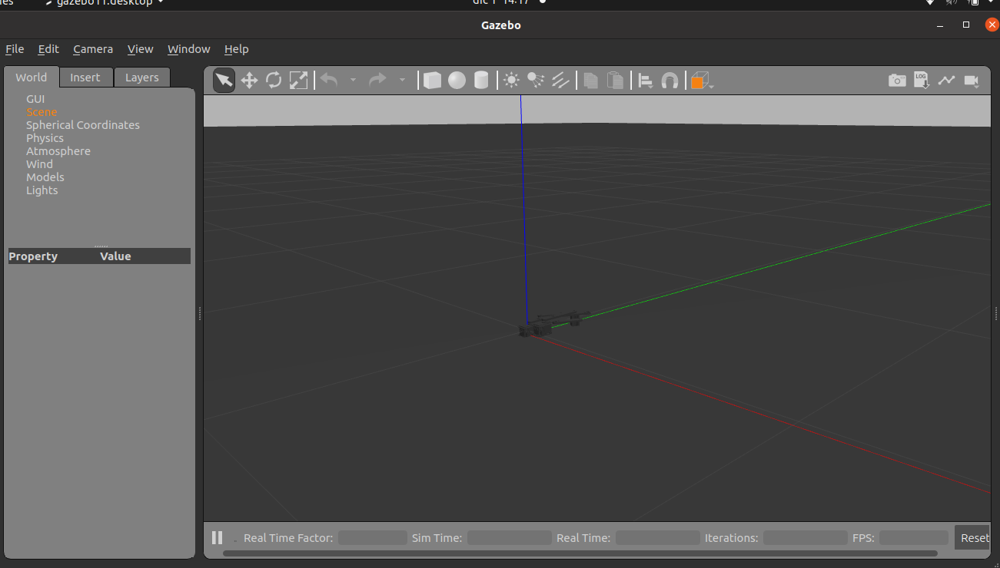

# Manipulador Paralelo Plano en SolidWorks Integrado con ROS

Este proyecto representa un manipulador paralelo plano diseñado en SolidWorks y su integración con el sistema operativo de robots (ROS). El objetivo principal de este proyecto es permitir el control y la comunicación con el manipulador paralelo plano a través de ROS.

## Contenido del Proyecto

El repositorio incluye los siguientes elementos clave:


- **Launch:** El directorio 'launch' contiene archivos de lanzamiento (launch files) para configurar y ejecutar el manipulador en ROS.


<p align="center">
<a name="launch1"></a>

</p>

La [imagen](#launch1) resume la importancia fundamental de este archivo launch en un entorno de trabajo, ya que este permite efectuar su lanzamiento.


- **URDF (Unified Robot Description Format):** El directorio 'urdf' contiene la descripción del robot en el formato URDF, que se utiliza para definir la estructura y las características del manipulador.

<p align="center">
<a name="urdf"></a>

</p>


La [imagen](#urdf) proporciona una representación visual que esencialmente ilustra la descripción del robot a través del archivo URDF (Universal Robot Description Format). En este archivo, se encuentra codificada información crítica relacionada con la cinemática, las inercias y otros aspectos fundamentales que desempeñan un papel crucial en el funcionamiento y control del robot.


- **Archivo YAML:** El archivo YAML contiene configuraciones y parámetros importantes para la comunicación y el control del manipulador.


- **Nodos de Comunicación:** El proyecto también incluye nodos de ROS que facilitan la comunicación y el control del manipulador paralelo plano. Estos nodos están en desarrollo continuo para mejorar la funcionalidad de la comunicación con el manipulador.

<p align="center">
  
</p>

La estructura ordinal de un nodo se ve reflejado en la figura anterior.

## Estado del Proyecto

El proceso de comunicación y control del manipulador está en desarrollo activo. Actualmente, estamos trabajando en la implementación de las capacidades de control y en la mejora de la interacción con el manipulador a través de ROS. A medida que el proyecto avanza, esperamos agregar más funcionalidades y características.


##Requisitos

Para la visualización del proyecto, necesitará instalar ROS. Este lo puede ejecutar en ubuntu 20.04. 

Para mayor información, vaya el siguiente enlace: http://wiki.ros.org/ROS/Installation 


##Ejecución del proyecto
### Paso 1: Crear un Espacio de Trabajo (Workspace)

Primero, abre tu terminal y crea un directorio para tu espacio de trabajo utilizando los siguientes comandos:

```bash
$ mkdir mi_espacio_de_trabajo
$ cd mi_espacio_de_trabajo
```
donde,
**mi_espacio_de_trabajo:** es el nombre del directorio a crear

Asegurar que estes en el directorio del espacio de trabajo y ejecutar:

```bash
$ sudo apt update
$ catkin_make
```

Luego, deberá clonar el repositoro en el directorio fuente:

```bash
$ git clone https://github.com/kevin-ortega2724/parallel_manipulator_2rrr/tree/main/src
```

En este directorio encintrará:

- **nodepack:** la carpeta incluye script de comunicación.
- **manipulador:** la carpeta incluye archivos de de ejecución, archivos urdf, arhivos launch y los archivos stl necesarios para la ejecución.

Si el trabajo es en ROS , es posible que SE necesite configurar el entorno de ROS después de instalar un paquete. Esto se hace utilizando el comando `source devel/setup.bash` en el directorio de espacio de trabajo de ROS.

El comando `source devel/setup.bash` carga las configuraciones del entorno de trabajo de ROS y establece las variables de entorno necesarias para que ROS pueda encontrar y utilizar los paquetes y recursos correctamente.

Asegúrarse de ejecutar este comando en el directorio principal de tu espacio de trabajo de ROS después de instalar un paquete, para que comenzar a usarlo sin problemas.

```bash
$ cd /ruta/a/tu/espacio_de_trabajo
$ source devel/setup.bash
```
Luego, ejecutar en el directorio:

```bash
$ roslaunch manipulador gazebo.launch
```

Se debe observar el manipulador en Gazebo:



Al ejecutar `rostopic list`, se observará la lista de tópicos generados:
`
/calibrated 
/clock
/gazebo/link_states
/gazebo/model_states
/gazebo/parameter_descriptions
/gazebo/parameter_updates
/gazebo/performance_metrics
/gazebo/set_link_state
/gazebo/set_model_state
/rosout
/rosout_agg
/tf
`
Cada uno de estos es necesario para la ejecución y visualización de los datos del manipulador.


## Contribuciones

Expresamos nuestro sincero agradecimiento a la Facultad de Ingeniería Mecánica de la Universidad Tecnológica de Pereira por su valiosa contribución. Estamos entusiasmados por colaborar con la comunidad de ROS y avanzar juntos en el desarrollo de este proyecto, que promete ser una herramienta valiosa para la investigación y el desarrollo de manipuladores paralelos planos.


